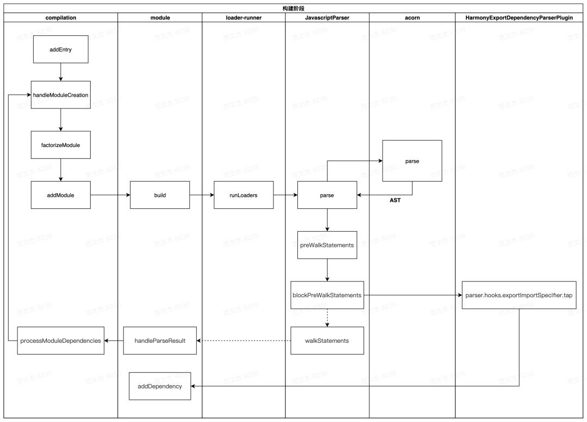
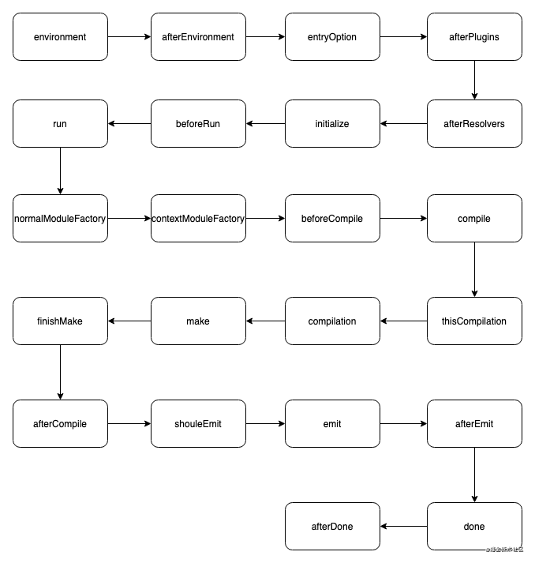
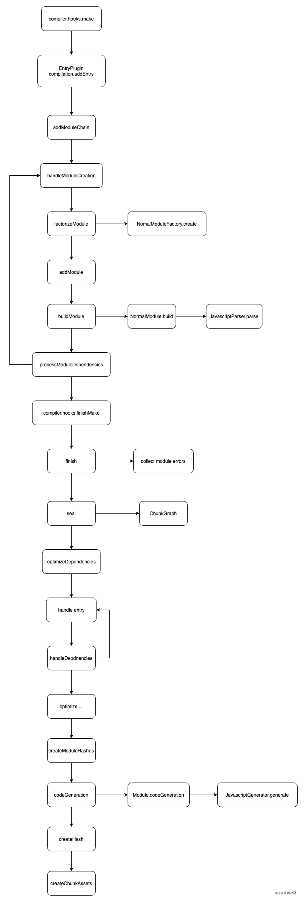

unplugin系列插件对于解决代码冗余，解放生产力都是个不错的选择。

unplugin-vue-components能够减少频繁而不必要的引入，从而减少工作量。这么好的插件，让我们看看它的实现细节吧！

:::tip
该文章需要webpack的基础知识，强烈推荐阅读使用后，再来看此文章。不必了解的特别深入，对于复杂的地方会做简单说明。
:::

## 实现思路

我们希望webpack可以在编译的时候，通过在sfc中找到引入组件的标签，如`<custome-component />`。找到后，动态的添加一个对应的组件引用到`<script>`的开头。

这样就把复杂的问题交给webpack去处理，而不需要我们去做什么了。

再来按步骤分析一下：

1. 对所有vue文件继进行遍历，找到没有引用但实际使用的组件tag。
2. 针对组件tag再指定文件中寻找相应组件，有则引入，无则不处理。

乍一看，问题似乎没有难度。但请思考以下问题：

1. 如何在webpack中修改源代码？或者说什么时机修改源代码？
2. 在插件中如何动态引入loader？

## 了解webpack机制

1. 初始化所有配置信息（包括，命令行参数、options、环境变量等等）。
2. 从入口文件开始递归构建依赖图，同时将非js module通过loader转化为js module。
3. 对module进行优化、压缩等。
4. 对module进行分解、组合形成chunk，输出资源。

webpack同时在执行的整个生命周期内，允许通过插件的形式动态修改配置、module。

为了解插件具体执行流程，再细分一下，同时也会把主要的生命周期钩子进行标明。

:::tip
在此之前，对上述提及的各类技术名词不太熟悉的同学，可以先看看简介：

* Entry：编译入口，webpack 编译的起点
* Compiler：编译管理器，webpack 启动后会创建 compiler 对象，该对象一直存活知道结束退出
* Compilation：单次编译过程的管理器，比如 watch = true 时，运行过程中只有一个 compiler 但每次文件变更触发重新编译时，都会创建一个新的 compilation 对象
* Dependence：依赖对象，webpack 基于该类型记录模块间依赖关系
* Module：webpack 内部所有资源都会以“module”对象形式存在，所有关于资源的操作、转译、合并都是以 “module” 为基本单位进行的
* Chunk：编译完成准备输出时，webpack 会将 module 按特定的规则组织成一个一个的 chunk，这些 chunk 某种程度上跟最终输出一一对应
* Loader：资源内容转换器，其实就是实现从内容 A 转换 B 的转换器
* Plugin：webpack构建过程中，会在特定的时机广播对应的事件，插件监听这些事件，在特定时间点介入编译过程
:::

1. 从`new webpack(options)`开始的各种初始化，其实对于我们而言没有多大的用处。但需要了解下具体做了什么事情。
   初始化时，对各种配置做规范化处理，创建`compiler`对象，加载内置以及自定义插件。
   entryOption、afterPlugins、beforeRun在此之前触发，可用于修改配置。
2. 从entry入口，递归进行依赖构建。compilation记录了单次编译内容，通过解析ast，并递归解析依赖完成构建。大致流程如下：
   1. 如果source code为非js资源，调用loader转化为js code, 再将source code转化成ast，否则直接转化。
   2. 遍历ast，触发exportImportSpecifier钩子，解析依赖。
   3. 添加依赖到当前module的依赖图谱中。
   4. ast遍历完成后，控制流回到第一步，直到所有依赖图谱构建完成。
   
   beforeCompile、compile、thisCompilation、compilation发生在该阶段，而loader实际触发的地方则是在compilation。
   
   
3. 依赖图谱构建完成，代码也完成转换，开始进行优化操作。
   1. 遍历 compilation.modules ，记录下模块与 chunk 关系。
   2. 触发各种模块优化钩子，这一步优化的主要是模块依赖关系。
   3. 遍历 module 构建 chunk 集合。
   4. 触发各种优化钩子。
   5. 遍历 chunk 集合，调用 compilation.emitAsset 方法标记 chunk 的输出规则，即转化为 assets 集合。
   
   此时还未完成编译，仍在compilation钩子内，同时各种优化钩子都会在这一阶段触发。如optimize、optimizeModules等。
4. 准备emit输出，将 assets 写入文件系统。emit、afterEmit钩子在此时触发，用于最后需改内容。
5. compilation正式结束，done钩子触发。

可以看到，从entry入口正式开始构建开始，loader的转化，主要钩子的触发都集中在compilation中。熟悉compilation则变得很重要。

同时我们也可以回答上面的问题：如何在webpack中修改源代码？或者说什么时机修改源代码？

修改源代码的地方应该放在loader。因为在loader中进行修改后，webpack会将code转化成ast，并触发import钩子，递归完成图谱的构建。
放在其它地方，则无法让webpack感知依赖的构建，自然添加后也是无用之举。

## unplugin的loader实现

了解了webpack机制后，清楚了代码的修改需要在loader中处理。那就从源码的角度来看看unplugin是如何实现的！

通过`unplugin-vue-components package.json`的`main`属性输出文件`dist/index.js`，而`dist/index.js`又是通过`npm run build`生成，也就是`src/index.js`，
最终定位到核心位置`src/core/unplugin.ts`。

在`unplugin.ts`中有一段代码：

```js
{
   async transform(code, id) {
      if (!shouldTransform(code))
         return null
      try {
         const result = await ctx.transform(code, id)
         ctx.generateDeclaration()
         return result
      }
      catch (e) {
         this.error(e)
      }
   },
}
```

此段代码会在匹配的module进行翻译操作，即loader中会执行的函数——可以就把它当成loader看待。

:::tip
你或许会好奇为什么`transform`函数会在loader中运行，这个涉及了`unplugin`插件，后面会做说明。现在就把它当成loader吧。
:::

`transform`判断了死否经过转化，有则跳过，没有则开始转化。接下来看具体转化逻辑。

通过层层调用，最终找到了真正的`transform`函数：

```js
export default function transformer(ctx: Context, transformer: SupportedTransformer): Transformer {
  return async (code, id, path) => {
    ctx.searchGlob()

    const sfcPath = ctx.normalizePath(path)
    debug(sfcPath)

    const s = new MagicString(code)

    await transformComponent(code, transformer, s, ctx, sfcPath)
    if (ctx.options.directives)
      await transformDirectives(code, transformer, s, ctx, sfcPath)

    s.prepend(DISABLE_COMMENT)

    const result: TransformResult = { code: s.toString() }
    if (ctx.sourcemap)
      result.map = s.generateMap({ source: id, includeContent: true })
    return result
  }
}
```

1. 有两个参数，一个转化上下文（记录了转化的记录和函数），转化类型，现有vue2和vue3区分。
2. `searchGlob`通过`fast-glob`轮子，快速搜索指定文件下组件并构建自己依赖图。
3. 开始转化组件，开始转化指令。
4. 将转化后code返回。

这里两个特别重要的调用分别是：`ctx.searchGlob()`和` await transformComponent(code, transformer, s, ctx, sfcPath)`

其中`searchGlob`是在指定文件夹下递归构建图谱，并不复杂。主要来看`transformComponent`的实现：

```js
export default async function transformComponent(code: string, transformer: SupportedTransformer, s: MagicString, ctx: Context, sfcPath: string) {
  let no = 0

  const results = transformer === 'vue2' ? resolveVue2(code, s) : resolveVue3(code, s)

  for (const { rawName, replace } of results) {
    debug(`| ${rawName}`)
    const name = pascalCase(rawName)
    ctx.updateUsageMap(sfcPath, [name])
    const component = await ctx.findComponent(name, 'component', [sfcPath])
    if (component) {
      const varName = `__unplugin_components_${no}`
      s.prepend(`${stringifyComponentImport({ ...component, as: varName }, ctx)};\n`)
      no += 1
      replace(varName)
    }
  }

  debug(`^ (${no})`)
}
```

1. 匹配组件中所有的tag元素，并输出对象。
2. 遍历tag对象，寻找component并注入组件依赖，同时完成名称的民命方式转化。

可以看出，这里是真正完成替换的地方了。在来看看是如何解析tag的。

```js
const resolveVue2 = (code: string, s: MagicString) => {
  const results: ResolveResult[] = []

  for (const match of code.matchAll(/_c\([\s\n\t]*['"](.+?)["']([,)])/g)) {
    const [full, matchedName, append] = match

    if (match.index != null && matchedName && !matchedName.startsWith('_')) {
      const start = match.index
      const end = start + full.length
      results.push({
        rawName: matchedName,
        replace: resolved => s.overwrite(start, end, `_c(${resolved}${append}`),
      })
    }
  }

  return results
}
```

1. 通过正则匹配`_c('div')`，创建元素函数，获取tag名称。
2. 存储对象，`{rawName，replace}`。replace用于替换修改的名称命名。

loader中实际做的事无非：正则寻找tag，通过tag寻找component，找到component后完成再注入到组件内。

当然，内部还有很多细节：
1. component依赖如何构建，如何查找？
2. 指令的生成？
3. `stringifyComponentImport`具体如何操作？

等等，就交给读者自己去探索了。

## 在plugin中加入loader

在使用`unplugin-vue-component`时，直接引入了插件，并没有loader的加载，这是怎么做到的呢？

这是用到的`unplugin`插件，能够帮你处理这部分的内容，来看看：

在`unplugin`的`src/core/unplugin.ts`中有这么一段代码。

```ts
if (plugin.transform) {
   const useLoader: RuleSetUseItem[] = [{
      loader: `${TRANSFORM_LOADER}?unpluginName=${encodeURIComponent(plugin.name)}`
   }]
   const useNone: RuleSetUseItem[] = []
   compiler.options.module.rules.push({
      enforce: plugin.enforce,
      use: (data: { resource: string | null, resourceQuery: string }) => {
         if (data.resource == null) {
            return useNone
         }
         const id = normalizeAbsolutePath(data.resource + (data.resourceQuery || ''))
         if (!plugin.transformInclude || plugin.transformInclude(id)) {
            return useLoader
         }
         return useNone
      }
   })
}
```

1. 首先判断options中是否存在`tranform`，存在则开始添加loader。
2. 存在两个loader，一个内联loader用于判断当前module是否需要转化，一个则是空loader。
3. 给module.rules添加一个通用loader，用内联的方式匹配。
4. 判断是否有验证module的函数`transformInclude`，没有则匹配所有，有则匹配返回为true的module。

在最下面的最后执行，首先时被`vue-loader`转化，接着则是通配loader。这就是为什么正则匹配的是`_c`而非`<`。

上述的代码发生在apply中，也就是webpack整个流程的初始化阶段，此时尚未进行loader转化，动态添加规则没有问题。

至此，`unplugin-vue-component`的核心就解析完了。

## 总结

查看源码的收获：
1. 熟悉了webpack的机制，但离熟悉掌握还有段距离。
2. 知道了unplugin机制、loader机制，以及两者如何配合使用。但plugin具体有哪些钩子，有哪些作用还不熟悉。
3. MagicString可用于快速替换内容。
4. FastGlob可用于搜索文档结构，生成需要的对象。
5. 了解了`unplugin`系列插件的使用。

常见的compiler钩子执行顺序：

<div style="background: #fff">
   
</div>

compilation钩子：

<div style="background: #fff">
   
</div>