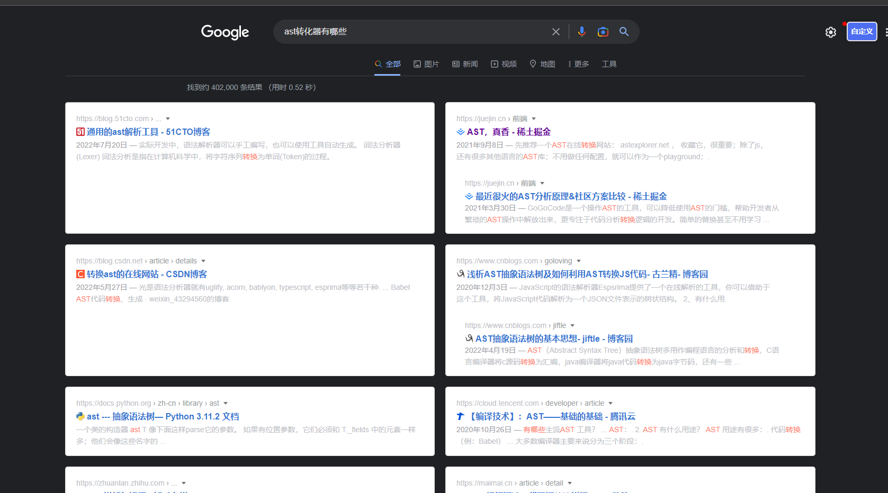

# 对于vue2项目工程化思考

基于vue-cli创建的项目。

## 项目结构的划分

从上倒下描述：

1. api：记录接口请求，需符合后端设计思路和使用思路。
2. asserts：静态文件，会经过webpack编译，应当包含image、svg、video、fonts四种类型（根据vue-cli配置而建议），对应的文件平级展开即可，不必再包含目录。
3. components：推荐使用文件目录加上index.vue的形式，并用unplugin-vue-components动态导入组件，减少代码的写入和提高可读性。组件又可分为无状态和有状态组件。
4. extras：当组件时由第三方复制而来并进行修改的话，不再适用于components，统一放置于extra中，结构和components保持一致，并在components存在一个对应注册组件。
5. directives、mixins、styles、utils形成单独的文件夹，并通过统一的出口index，最终在main.js中引入。存在的问题是，如果动态引入则可能无法获得良好的编辑器提示。损害了一部分开发效率(需要找解决方案)。
6. plugins：第三方内容的引入，独立各个包，清晰的知道引入了多少第三方模块，也避免了main文件过于臃肿。
7. layout：布局相关。
8. router：通过chain function的形式，将职责分离，利于维护。
9. store：严格遵循vuex的设计规范。
10. views：根据层级关系添加文件即可，同路由对应起立，否则再处理层级关系时，需要做额外的处理。

现存问题：
1. api的目录层级过多，混乱，查找需要层层寻找。多次定义相同的接口，而不是找类似的接口。数量越多上述问题越明显，逐渐臃肿。
2. directives、filters、utils没有良好提示，用户也无法逐个查找，造成反复定义，定义后仅一次调用，失去了复用性的同时，加重了冗余性和分散性。
3. 

:::tip
1. 其实并不建议utils文件夹，其会导致各种函数工具分散。且多个开发时，难以了解已有的函数，而无法正确使用。相反，将函数封装在具体的对象中，并限制用户定义utils，用户更会去找相关内容。
:::

## 针对不同的开发环境进行配置 

为不同的环境，如开发、测试、生产环境指定不同的变量，webpack配置，从而优化开发和打包。

开发中会遇到如下问题：

1. 请求地址的快速切换（切换地址后，需要手动打包）

   要切换地址，只能重新编译。因此，编译的速度应该尽可能的加快。

2. 开发过程不同本地后台地址避免线上冲突和频繁修改（不同开发人员由于开发配置不一而导致频繁冲突，增加无效git记录）

   设置不同的环境文件.env、.env.development、.env.development.local，development文件只进行最基本配置，local文件则配置自己需要的任何数据。
   local文件被git忽略不会上传，如果需要改变内容，重新执行run即可。

总结：vue-cli其实给了一个极佳的解决方案，即通过不同的env文件对配置进行区分。当要修改编译内容时，只需要改变配置重新编译。
需要避免修改可提交到git内的文件，应在文件中将环境变量的取值设为同一值，而只修改local文件配置。这样即可保证无效数据被提交。

## 如何减少二次dev的时间，加速构建速度

## API如何便捷对接后端多服务，并减少重复编写API

1. 如何命名：api.服务名.对象名.接口名，如 api.base.user.page、api.base.user.save
2. 暴露对象为Class，并对接口名统一规范，且返回值直观明了

需要前端严格控制，后端接口规范，且前后端指定好一套规范遵循下去，才能转动。

1. 清晰，无需层层点开。
2. 脱离前端的文档结构，而是更符合后端的服务结构。在一定程度上会避免前端结构api中重复出现后端相同api的情况。
3. 从服务的角度使用接口进行组合，更符合现实世界的交互。

缺点：

1. 没有用到的类方法无法被tree-shaking，造成生产环境资源的浪费。
