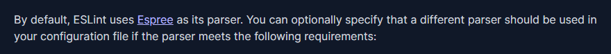
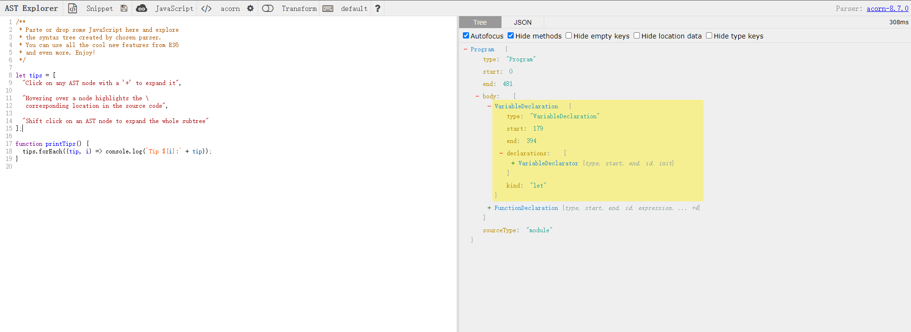
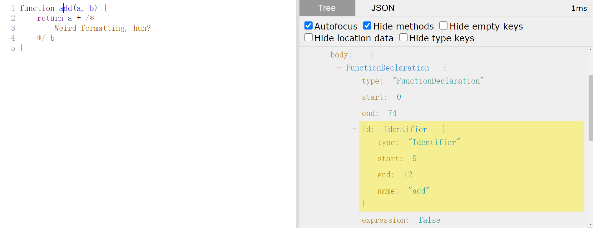

# Eslint自定义规则

eslint是代码规范工具，能够实时检测代码存在的样式错误。让代码样式化、统一化，提高语义性、可读性。

eslint默认提供了很多rule来规范代码，同时也有丰富多彩的第三方rule不断加入到大的生态中来。

但或多或少，它们并不能100%的解决在开发中所遇到的定制化问题。如，表格字段的按照一定的顺序排列（人、状态、单位、组织、时间）、
某一列字段属于必填项，但未作必填校验。

在庞大的项目中，通过人工手动地检查，修改，无疑是一项耗时、耗力的工作，同时无法保证完整的排查完毕。

为此，通过定制化的eslint rule替我们检查出问题，在编写的过程中即可避免问题。利用fix更能一键修复，何乐而不为呢。

开发eslint rule前，你需要知道eslint是如何配置、使用的！如果不清楚请先阅读[官方文档](https://eslint.org/docs/latest/use/getting-started)。

那么让我们准备开始吧。按照知识点大致列一下的大纲：
1. AST是什么，我们怎么修改它？
2. eslint rule的创建、测试和运用！
3. eslint是如何修复代码的？

<!-- more -->

## AST是什么，我们怎么修改它？

咱不去谈什么词法解析、语法解析等牛逼词语，直接了当的解释。

对于新手而言，AST就是一套工具，能够将一串string转化成类似Dom Tree的node树，然后你可以操作这棵树进行添加、删除、替换等操作，
最后再从node树转化成string交给js执行。

再简单点：AST允许对代码进行操作并执行。

有什么作用？我们敲代码不就是在做这种事情？当然是批量对代码进行修改啦，这样就不需要程序员苦苦的手动去修改重复性代码了，多好啊。

网上搜索了好多AST相关的知识，全部都是介绍AST是啥的？具体怎么使用还是一头雾水？只能说现在大家更多关注的是它是什么，而不去说它要怎么做！

好吧，那让我们来补上把：

### 如何操作AST？

既然知道了AST是一个工具，那么就去把工具找出来。

怎么搜呢？

直接输入：js ast？好像不行，全是介绍AST是什么，再多点就是告诉你利用babel可以做代码转换。


输入：ast有哪些转换器？还是不行啊，全是断断续续的内容。


好吧。那让咱来介绍一下吧。

咱之前说，ast其实就是一个工具，这个工具的名字专业点叫做解析器。在文章中，常能看到人拿babel来说事。

babel在这里就叫做解析器。但解析器是否只有这一种呢？当然不是，在eslint的config文章中能看到如下一句话：



> By default, ESLint uses Espree as its parser. You can optionally specify that a different parser should be used in your configuration file if the parser meets the following requirements:

默认地，eslint使用Espree作为解析器。

咱可以知：AST解析器有很多种，可以将多种不同code解析成node tree。

常见的AST解析器有：（咱这里还有一个小技巧：在浏览器输入框输入 Espree vs试试🤣）


1. Espree：eslint默认。 
2. Esprima: 常见。
3. babel/parse：babel默认。 
4. vue-eslint-parser：解析vue template。

好，现在知道了有哪些AST工具了，选一个常用的recast工具（采用 Esprima 解析器），进入[github](https://github.com/benjamn/recast)看一下示例：

:::tip
recast是对AST解析器的更高层次封装，提供了更多的工具函数对AST进行操作。Esprima只是用于对code进行解析。
:::

```javascript
import * as recast from "recast";

// The string code
const code = [
  "function add(a, b) {",
  "  return a +",
  "    // Weird formatting, huh?",
  "    b;",
  "}"
].join("\n");

// parse code
const ast = recast.parse(code);
```

嗯！很简单嘛！`parse`是解析。要转回string，用`print`就好了。

那让咋把函数名改为"addPlus"试试手。

...

这可咋改啊，啥都不了解啊！ast tree啥样都不知道，咋做修改呢？

那再来看看ast tree会变成什么样子吧！

### AST Tree长什么样？

咱知道，ast解析器多种多样，总不能解析出来ast tree全都不同，咋个兼容使用呢？为此es提供了具体的标准，供大家参考实现。

所以大致上ast tree解析出来是相近的，除了一些自定义的code。

这里推荐使用：[astexplorer](https://astexplorer.net/) 在线解析工具，可选择不同语言，不同解析器，直接地将解析结果显示在右侧。



将上述代码string粘贴到左侧代码区，点击到add上。可以看到左侧结果为：



尝试修改一下：

```javascript
import * as recast from "recast";

// The string code
const code = [
    "function add(a, b) {",
    "  return a +",
    "    // Weird formatting, huh?",
    "    b;",
    "}"
].join("\n");

// parse code
const ast = recast.parse(code);
// body[0] 表示第一个选中的函数表达式
// id 为标识符
// name 为标识符名称，修改目标
ast.body[0].id.name = 'addPlus'
console.log(recast.print(ast))
```

修改成功！

但是如果存在多个函数，该怎么查找修改的具体位置呢？总不能继续通过不断的key来定位吧。

recast允许对dom节点进行遍历，并通过type定义在遍历到指定的type时执行相关代码。

```javascript
import * as recast from "recast";

// The string code
const code = [
    "function add(a, b) {",
    "  return a +",
    "    // Weird formatting, huh?",
    "    b;",
    "}"
].join("\n");

const ast = recast.parse(code);

ast.visit(ast, {
    visitIdentifier(path) {
        const node = path.node // get node
        if(node.id.name === 'add') { // if name equal with add
            node.id.name = 'addPlus' // modify add name to addPLus
            return false // stop depth
        }
        this.traverse(path) // continue
    }
})

console.log(recast.print(ast))
```

recast利用visit函数对ast进行遍历，在Identifier类型我们设置了函数，该函数会在访问到Identifier类型节点时执行。

我们可以判断当前标识符是否为add，从而做出修改。如此，硬编码就变成了活的。

接下来你又会说：ast tree都有哪些节点呢？我总不能全部记下来吧。

当然不需要，善用[astexplorer](https://astexplorer.net/)很容易就能知道类型了。但如果你想知道类型后的具体含义，[es5-types](https://github.com/estree/estree/blob/master/.md)能够给你解答。

recast除了提供遍历功能外，还有builders用于对node节点的构建（类似于dom的createElement），当然recast是采用了[ast-types](https://github.com/benjamn/ast-types)，想要知道具体用法，你需要查看该文档。

至此：

1. 从AST大致是个啥？
2. 到如何如何基本使用AST工具！
3. 再到AST存在哪些类型！

都能够的串联起来了，不至于一头雾水，就是涉及的东西多了点，多看看多试试吧。那么回归主题，开发eslint rules吧。

## eslint rule的创建、测试和运用！

eslint是对ast一项运用，也是在项目工程化过程中不可或缺的一部分。为了达到定制化，自定义规则势在必行。

先来大概说一下原理：

再了解了ast后，我们能猜测出eslint大概做了什么事情——解析code，对节点遍历，根据rule配置对节点进行操作，最后输出string code。

eslint其实就是做了这么一个事情。为了了解的更加清晰，再来更加细化一下：

1. 将code通过Espree转化为AST。
2. 遍历AST收集节点，将AST拍平成为数组AST_ARR。
3. 遍历rule集合为对应的节点添加事件。
4. 遍历AST_ARR执行对应事件，此处分为两种，一种是从上往下，一种是冒泡执行。此时已经能够获的报错信息了。
5. 如果要修复的化，遍历Fixer完成修复工作。

知道了大致的工作原理，那就开始实践：

### 创建rule create

在任意一个包含eslint的项目内，打开.eslint文件。可以看到rule被定义为了{ key: string }的形式。

这是因为eslint会去require('string')找到对应的定义。

如果我们开发的话，直接定义为标准模式即可。

```javascript
module.exports = {
    rules: {
        'custom-rule': {
            meta: {
                type: 'suggestion', // `problem`, `suggestion`, or `layout`
                docs: {
                    description: "description",
                    categories: ['recommended'],
                    url: null, // URL to the documentation page for this rule
                },
                fixable: 'code', // Or `code` or `whitespace`
                schema: [
                    {
                        type: 'array',
                    }
                ], // Add a schema if the rule has options
            },
            create(context) {
                return {
                    Identifier(node) {
                        // do any thing
                    }
                }
            }
        },
    }
}
```

首先设置了meta的一些信息，主要是告诉eslint，该rule的类型，描述、建议、参数规范等。

接下来的create才是正真rule的核心部分。其包含一个context，包含了eslint封装的用于处理配置、源代码、查找等方法。具体可参考：[eslint-context](https://eslint.org/docs/latest/extend/custom-rules#the-context-object)

create必须返回一个对象，对象内包含了两个部分，一个是selector，一个是eslint钩子事件。

selector主要就是解析后的ast node,类似css selector的形式。eslint钩子主要包括：onCodePathStart和onCodePathEnd。

selector可以参考：[eslint-rules](https://eslint.org/docs/latest/extend/custom-rules#rule-basics)
events可以参考：[code-path-analysis](https://eslint.org/docs/latest/extend/code-path-analysis)

了解之后，还是那上面的举例。

```javascript
module.exports = {
    rules: {
        'custom-rule': {
            meta: {
                type: 'suggestion', // `problem`, `suggestion`, or `layout`
                docs: {
                    description: "description",
                    categories: ['recommended'],
                    url: null, // URL to the documentation page for this rule
                },
                fixable: 'code', // Or `code` or `whitespace`
                schema: [
                    {
                        type: 'array',
                    }
                ], // Add a schema if the rule has options
            },
            create(context) {
                return {
                    'Identifier[name=add]': function (node) {
                        return node.report({
                            message: '不能以add命名',
                            node,
                        })
                    }
                }
            }
        },
    }
}
```

eslint会在Identifier命名为add处执行custom-rule。然后报告错误：“不能以add命名”。

## 参考链接

1. [AST与前端工程化实战](https://zhuanlan.zhihu.com/p/77696194)
2. [Read JavaScript Source Code, Using an AST](https://www.digitalocean.com/community/tutorials/js-traversing-ast)
3. [ast-types](https://github.com/benjamn/ast-types/blob/master/src/def/core.ts)
4. [Where can I view all the eslint ast node types?](https://stackoverflow.com/questions/39665292/where-can-i-view-all-the-eslint-ast-node-types)
5. [estree-es5](https://github.com/estree/estree/blob/master/es5.md)
6. [recast](https://github.com/benjamn/recast/blob/master/README.md)
7. [eslint-rules](https://eslint.org/docs/latest/extend/custom-rules#the-context-object)
