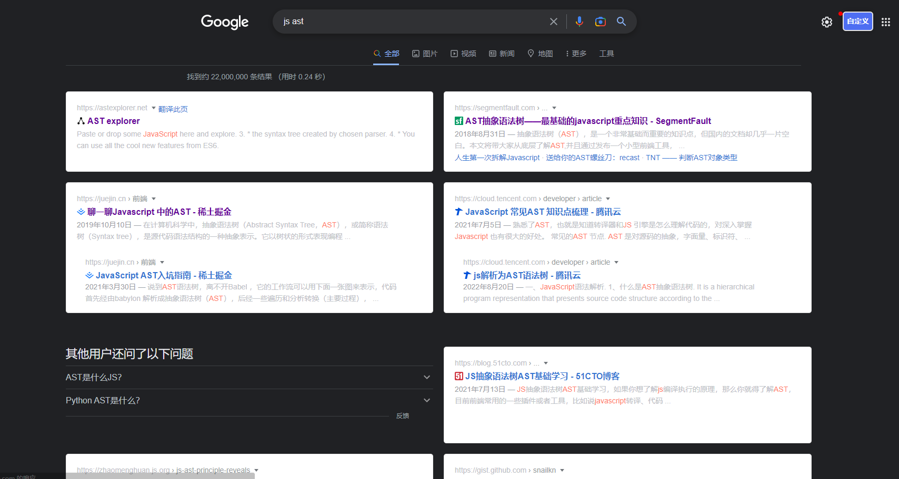
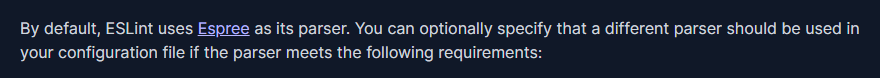
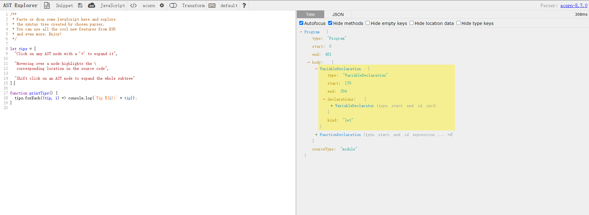

# Eslint自定义规则

eslint是代码规范工具，能够实时检测代码存在的样式错误。让代码样式化、统一化，提高语义性、可读性。

eslint默认提供了很多rule来规范代码，同时也有丰富多彩的第三方rule不断加入到大的生态中来。

但或多或少，它们并不能100%的解决在开发中所遇到的定制化问题。如，表格字段的按照一定的顺序排列（人、状态、单位、组织、时间）、
某一列字段属于必填项，但未作必填校验。

在庞大的项目中，通过人工手动地检查，修改，无疑是一项耗时、耗力的工作，同时无法保证完整的排查完毕。

为此，通过定制化的eslint rule替我们检查出问题，在编写的过程中即可避免问题。利用fix更能一键修复，何乐而不为呢。

开发eslint rule前，你需要知道eslint是如何配置、使用的！如果不清楚请先阅读[官方文档](https://eslint.org/docs/latest/use/getting-started)。

那么让我们准备开始吧。按照知识点大致列一下的大纲：
1. AST是什么，我们怎么修改它？
2. eslint rule的创建、测试和运用！
3. eslint是如何修复代码的？

<!-- more -->

## AST是什么，我们怎么修改它？

咱不去谈什么词法解析、语法解析等牛逼词语，直接了当的解释。

对于新手而言，AST就是一套工具，能够将一串string转化成类似Dom Tree的node树，然后你可以操作这棵树进行添加、删除、替换等操作，
最后再从node树转化成string交给js执行。

再简单点：AST允许对代码进行操作并执行。

有什么作用？我们敲代码不就是在做这种事情？当然是批量对代码进行修改啦，这样就不需要程序员苦苦的手动去修改重复性代码了，多好啊。

网上搜索了好多AST相关的知识，全部都是介绍AST是啥的？具体怎么使用还是一头雾水？只能说现在大家更多关注的是它是什么，而不去说它要怎么做！

好吧，那让我们来补上把：

### 如何操作AST？

既然知道了AST是一个工具，那么就去把工具找出来。

怎么搜呢？

直接输入：js ast？好像不行，全是介绍AST是什么，再多点就是告诉你利用babel可以做代码转换。



输入：ast有哪些转换器？还是不行啊，全是断断续续的内容。


好吧。那让咱来介绍一下吧。

咱之前说，ast其实就是一个工具，这个工具的名字专业点叫做解析器。在文章中，常能看到人拿babel来说事。

babel在这里就叫做解析器。但解析器是否只有这一种呢？当然不是，在eslint的config文章中能看到如下一句话：



> By default, ESLint uses Espree as its parser. You can optionally specify that a different parser should be used in your configuration file if the parser meets the following requirements:

默认地，eslint使用Espree作为解析器。

咱可以知：AST解析器有很多种，可以将多种不同code解析成node tree。

常见的AST解析器有：（咱这里还有一个小技巧：在浏览器输入框输入 Espree vs试试🤣）


1. Espree：eslint默认。 
2. recast: 常见。
3. babel/parse：babel默认。 
4. vue-eslint-parser：解析vue template。

好，现在知道了有哪些AST工具了，选一个常用的recast，进入[github](https://github.com/benjamn/recast)看一下示例：

```javascript
import * as recast from "recast";

// The string code
const code = [
  "function add(a, b) {",
  "  return a +",
  "    // Weird formatting, huh?",
  "    b;",
  "}"
].join("\n");

// parse code
const ast = recast.parse(code);
```

嗯！很简单嘛！`parse`是解析，要转回string，用`print`就好了。

那让咋把函数名改为"addPlugs"试试手。

...

这可咋改啊，啥都不了解啊！ast tree啥样都不知道，咋做修改呢？

那再来看看ast tree会变成什么样子吧！

### AST Tree长什么样？

咱知道，ast解析器多种多样，总不能解析出来ast tree全都不同，咋个兼容使用呢？为此es提供了具体的标准，供大家参考实现。

所以大致上ast tree解析出来是相近的，除了一些自定义的code。

这里推荐使用：[astexplorer](https://astexplorer.net/) 在线解析工具，可选择不同语言，不同解析器，直接地将解析结果显示在右侧。



将上述代码string粘贴到左侧代码区，点击到add上。可以看到左侧结果为：


